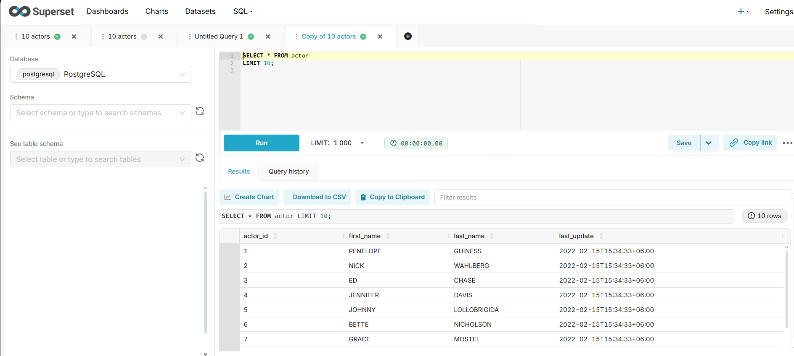
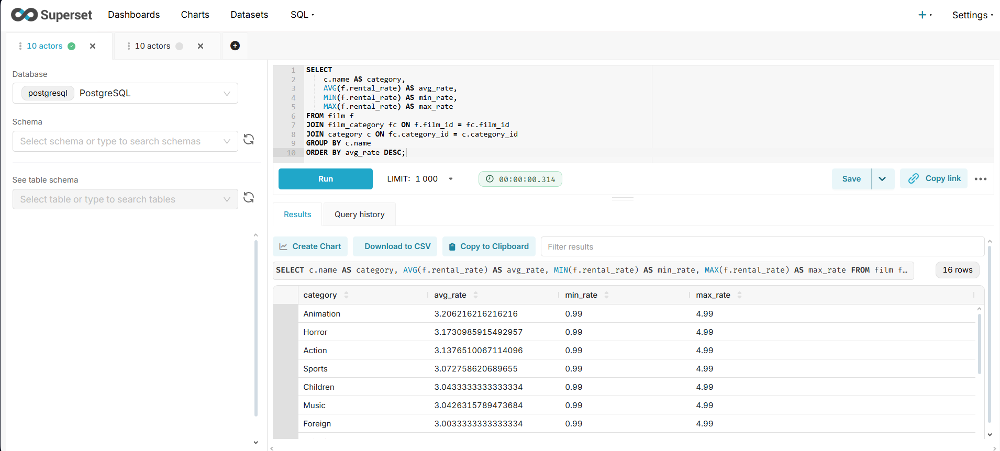

# CineAnalytics 🎬

## Company Overview
**CineAnalytics** is an analytics company focused on the movie rental business.  
We provide insights into films, actors, customers, and transactions.  
This project demonstrates how to use **PostgreSQL + Pagila dataset + Apache Superset** to perform analytics and build dashboards.  

---

## Project Description
The goal of this project is to analyze the **Pagila** database (a sample movie rental dataset) using SQL queries and visualize results in **Apache Superset**.  

The analytics includes:  
- Customer activity and revenue trends  
- Popular movies and actors  
- Rental frequency by category  
- Average payments and sales per region  
- Comparative KPIs  

---

## Screenshots
Example of analytics dashboard in Superset:  

  

---

## How to Run the Project

### 1. Requirements
- **PostgreSQL** (with Pagila dataset imported)  
- **Python 3.10+**  
- **Apache Superset** installed in virtual environment  
- Browser (for Superset UI)  

### 2. Setup Steps
```bash
# Clone repository
git clone https://github.com/<your-username>/cineanalytics.git
cd cineanalytics

# Create and activate virtual environment
python -m venv venv
venv\Scripts\activate   # Windows

# Install Superset
pip install apache-superset psycopg2-binary

# Configure Superset SECRET_KEY
echo "SECRET_KEY = 'your_generated_secret_key'" > superset_config.py

# Initialize Superset
set FLASK_APP=superset
superset db upgrade
superset fab create-admin
superset init

# Run Superset
superset run -p 8088
```

### 2. Access
Open in browser: http://localhost:8088

Login with your admin credentials.

### SQL Queries

All analytical queries are saved in queries.sql
.
Examples:
``` sql
-- Show first 10 actors
SELECT * FROM actor LIMIT 10;
```


``` sql
-- actors whose name starts with "A" sorted by last name
SELECT first_name, last_name, last_update
FROM actor
WHERE first_name LIKE 'A%'
ORDER BY last_name ASC;
```


``` sql
-- average, minimal, maximum rental rate by category
SELECT 
    c.name AS category,
    AVG(f.rental_rate) AS avg_rate,
    MIN(f.rental_rate) AS min_rate,
    MAX(f.rental_rate) AS max_rate
FROM film f
JOIN film_category fc ON f.film_id = fc.film_id
JOIN category c ON fc.category_id = c.category_id
GROUP BY c.name
ORDER BY avg_rate DESC;



```

-- Total rentals per film category
SELECT c.name, COUNT(r.rental_id) AS total_rentals
FROM category c
JOIN film_category fc ON c.category_id = fc.category_id
JOIN film f ON fc.film_id = f.film_id
JOIN inventory i ON f.film_id = i.film_id
JOIN rental r ON i.inventory_id = r.inventory_id
GROUP BY c.name
ORDER BY total_rentals DESC;
```

### Repository Contents
├── queries.sql        # SQL queries with comments
├── README.md          # Project documentation
├── images/            # Screenshots for README and report
└── superset_config.py # Superset configuration (SECRET_KEY etc.)


### Tools & Resources
- PostgreSQL with Pagila dataset
- Apache Superset for BI dashboards
- Python for environment setup
- SQL for data analysis queries
- Dataset: Pagila Sample Database

### Author
Ayana Ussenbayeva
