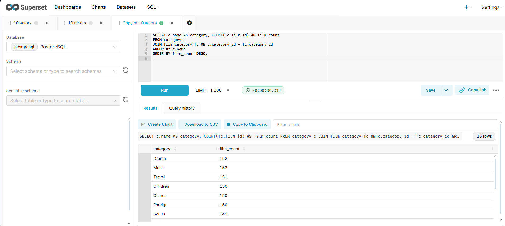
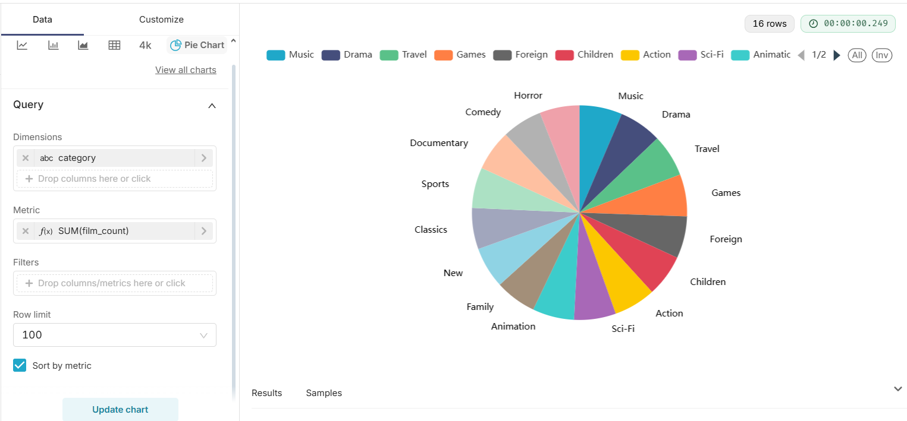
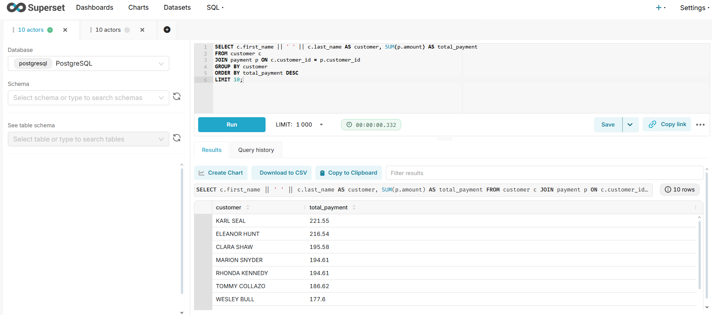
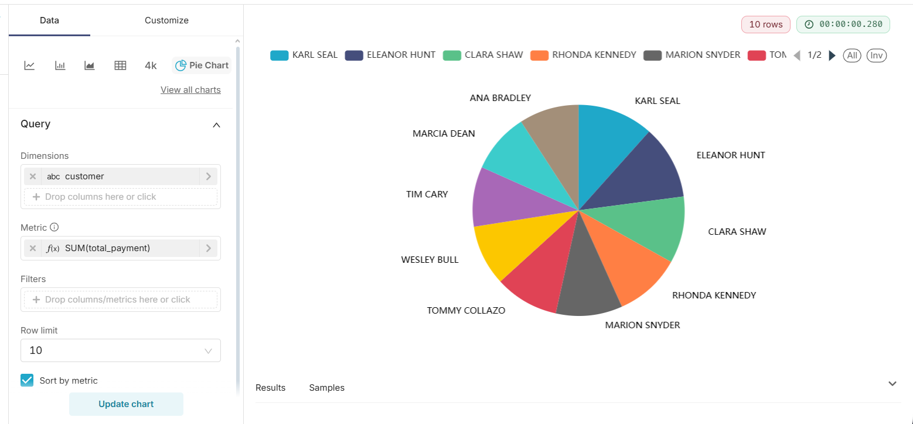

# CineAnalytics

## Company Overview
**CineAnalytics** is an analytics company focused on the movie rental business.  
We provide insights into films, actors, customers, and transactions.  
This project demonstrates how to use **PostgreSQL + Pagila dataset + Apache Superset** to perform analytics and build dashboards.  

---

## Project Description
The goal of this project is to analyze the **Pagila** database (a sample movie rental dataset) using SQL queries and visualize results in **Apache Superset**.  

The analytics includes:  
- Customer activity and revenue trends  
- Popular movies and actors  
- Rental frequency by category  
- Average payments and sales per region  
- Comparative KPIs  

---

## How to Run the Project

### 1. Requirements
- **PostgreSQL** (with Pagila dataset imported)  
- **Python 3.10+**  
- **Apache Superset** installed in virtual environment  
- Browser (for Superset UI)  

### 2. Setup Steps
```bash
# Clone repository
git clone https://github.com/<your-username>/cineanalytics.git
cd cineanalytics

# Create and activate virtual environment
python -m venv venv
venv\Scripts\activate   # Windows

# Install Superset
pip install apache-superset psycopg2-binary

# Configure Superset SECRET_KEY
echo "SECRET_KEY = 'your_generated_secret_key'" > superset_config.py

# Initialize Superset
set FLASK_APP=superset
superset db upgrade
superset fab create-admin
superset init

# Run Superset
superset run -p 8088
```
It will look something like this


### 2. Access
Open in browser: http://localhost:8088

Login with your admin credentials.

### SQL Queries

All analytical queries are saved in queries.sql
.
Examples:
``` sql
-- Show first 10 actors
SELECT * FROM actor LIMIT 10;
```


``` sql
-- actors whose name starts with "A" sorted by last name
SELECT first_name, last_name, last_update
FROM actor
WHERE first_name LIKE 'A%'
ORDER BY last_name ASC;
```


``` sql
-- average, minimal, maximum rental rate by category
SELECT 
    c.name AS category,
    AVG(f.rental_rate) AS avg_rate,
    MIN(f.rental_rate) AS min_rate,
    MAX(f.rental_rate) AS max_rate
FROM film f
JOIN film_category fc ON f.film_id = fc.film_id
JOIN category c ON fc.category_id = c.category_id
GROUP BY c.name
ORDER BY avg_rate DESC;
```


``` sql
SELECT c.name AS category, COUNT(fc.film_id) AS film_count
FROM category c
JOIN film_category fc ON c.category_id = fc.category_id
GROUP BY c.name
ORDER BY film_count DESC;
```



``` sql
---Total revenue per customer
SELECT c.first_name || ' ' || c.last_name AS customer, SUM(p.amount) AS total_payment
FROM customer c
JOIN payment p ON c.customer_id = p.customer_id
GROUP BY customer
ORDER BY total_payment DESC
LIMIT 10;
```



### Database Schema (ERD)
Pagila database schema used in this project:  


## Python Script (main.py)
We created a Python script to connect to the **Pagila** PostgreSQL database, run SQL queries, and print results.

### Example output
The script executes queries such as:
- Top 10 actors (`SELECT * FROM actor LIMIT 10`)
- Top 10 most active customers by rentals

Console output:


### How to run

1. Activate your virtual environment:
```bash
   venv\Scripts\activate    # Windows
```
2. Install requirements (if not already):
```
   pip install psycopg2 pandas
```
4. Run the script:
 ``` bash
   python main.py
```
4.The results will appear in the terminal and can also be saved into results.csv for further analysis.


### Repository Structure
├── queries.sql                    # SQL queries with comments  
├── README.md                      # Documentation  
├── pagila-schema-diagram.png      # ERD diagram of Pagila DB  
├── query_actor.png                # Example query result  
├── where+orderby.png              # Example query result  
├── groupby.png                    # Aggregation query result  
├── countcategory.png              # Pie chart query result  
├── countcategory_analytics.png    # Superset visualization  
├── main.py                        # Python script to run queries on PostgreSQL  


### Tools & Resources
- PostgreSQL with Pagila dataset
- Apache Superset for BI dashboards
- Python for environment setup
- SQL for data analysis queries
- Dataset: Pagila Sample Database

### Author
Ayana Ussenbayeva
